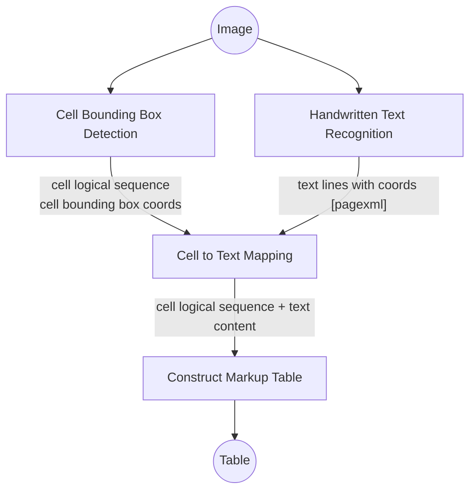

# Handwritten Table to Knowledge Graph

This project converts handwritten table images into structured Knowledge Graphs (KGs) with **cell-level provenance**.

❗ *Research Gap*: End-to-end processing of handwritten tables to structured Knowledge Graphs lacks reliability and traceability.

✅ Solution: We present a traceable and explainable pipeline that:

1. Reconstructs tables from scanned images (TSR + HTR)
2. Maps text content to source cells using bounding boxes or cell indexes.
3. Extracts RDF triples with **cell-level provenance**

---
Pipeline Diagram
---

```pgsql
 ┌───────────────────────────────────────────────────────────────┐
 │                           IMAGE                               │
 │            (Handwritten Historical Table Page)                │
 └───────────────────────────────────────────────────────────────┘
                            │
                            ▼
 ┌───────────────────────────────────────────────────────────────┐
 │                 1. TABLE RECONSTRUCTION                       │
 │  ┌───────────────────────────────┐   ┌──────────────────────┐ │
 │  │ 1(A) Cell Detection (TSR)     │   │ 1(B)Handwriting (HTR)│ │
 │  │                               │   │ Recognizer           │ │
 │  └───────────────────────────────┘   └──────────────────────┘ │
 │            │                                      │           |
 │            └───────── Merge into PageXML ─────────┘           |
 └───────────────────────────────────────────────────────────────┘
                            │
                            ▼
 ┌───────────────────────────────────────────────────────────────┐
 │                  2. PAGE XML → HTML TABLE                     │
 │  • Reconstruct structured <table><tr><td> from XML            │
 │    (preserving row/col spans + cell id)                       │
 └───────────────────────────────────────────────────────────────┘
                            │
                            ▼
 ┌───────────────────────────────────────────────────────────────┐
 │               3. ROW-LEVEL INFORMATION EXTRACTION             │
 │  For each table row:                                          │
 │   • Extract row text                                          │
 │   • OntoGPT(text, KG schema) →YAML                            │
 │   • YAML → Normalized JSON                                    │
 │   • Add provenance (cell ID, text spans)                      │
 └───────────────────────────────────────────────────────────────┘
                            │
                            ▼
 ┌───────────────────────────────────────────────────────────────┐
 │               4. KNOWLEDGE GRAPH CONSTRUCTION                 │
 │   • Build assertion triples                                   │
 │   • Build provenance triples                                  │
 │   • Output as RDF (Trig)                                      │
 └───────────────────────────────────────────────────────────────┘
                            │
                            ▼
 ┌───────────────────────────────────────────────────────────────┐
 │                     FINAL KNOWLEDGE GRAPH                     │
 │     (Traceable Entities to HTML Table & Source Image)         │
 └───────────────────────────────────────────────────────────────┘

```

---
## 1. Table Reconstruction (TSR + HTR)
### Approach-2 (Machine Learning Pipeline)

Convert image (e.g. jpg)→ structured table (e.g., HTML or 2D array)

#### Cell Bounding Box Detection (using LORE-TSR)

- Add LORE-TSR as a Submodule

   ```bash
   git submodule add git@github.com:Shoilee/Image2TableBoundingBoxDetection.git
   cd Image2TableBoundingBoxDetection
   ```

   This repo uses a modified version of [LORE-TSR](https://github.com/AlibabaResearch/AdvancedLiterateMachineryDocumentUnderstanding/LORE-TSR)** designed to work on *CPU-only* systems (no CUDA required).

   > 💡 *Note:* For full GPU (CUDA) support, use the original LORE-TSR repository.


- Create a conda environment:
   ```
   conda create --name Lore python=3.7
   conda activate Lore
   pip install -r requirements.txt
   ```

- Install DCNv2 from Scratch
   ```
   pip install Cython
   cd src/lib/models/networks/DCNv2
   chmod +x  *.sh
   ./make.sh
   ```

- Download Pretrained Model table cell detection model: model [ckpt_wireless](https://drive.google.com/file/d/1cBaewRwlZF1tIZovT49HpJZ5wlb3nSCw/view). Then create a model directory and move the downloaded file there:

   ```
   cd ../../../../../ 
   mkdir model
   ```

- Change the parameters such as model architecture, model path and input/output directory in `src/scripts/infer/demo_wired.sh`

- Run the scripts
   ```
   cd src
   bash scripts/infer/demo_wired.sh
   ```

---

#### Handwritten Text Recognition (using Loghi)

- Create the environment from the htr_env.yml file:
   ```bash
   conda env create -f htr_env.yml
   ```
- Pull loghi repo here 
   ```bash
   git clone git@github.com:knaw-huc/loghi.git
   ```
- Pull all the docker containers as per instructions
   ```bash
   docker pull loghi/docker.laypa
   docker pull loghi/docker.htr
   docker pull loghi/docker.loghi-tooling
   ```
- Go to: https://surfdrive.surf.nl/files/index.php/s/YA8HJuukIUKznSP and download 
   - a laypa model ("general") for detection of baselines and 
   - a loghi-htr model("float32-generic-2023-02-15") for HTR.

- Specify the parameter paths accordingly in `loghi/scripts/inference-pipeline.sh` (see original documentation of loghi)

- Run loghi to do HTR on table images
   ```
   python src/run_loghi.py
   ```


#### Reconstruct HTML table

   ```bash
   python src/reconstruct_table.py
   ```
---

### Approach-3 (Multi-run Conversation LLM)
1. 
```bash
cd Image2Table_LLM     
python run_modular_llm.py
```

2. 
```bash
run src/llm_pagexml.ipynb
```

---

## 2. Information Extraction (IE) 

📝 Extract attribute value, given desired schema, using:
- Regex patterns
- Large Language Models (LLMs)
- OntoGPT

## 3. KG Construction (Source-Aware Mapping)

🔄 Convert extracted information into RDF **triples**

📍 Track table structure (bounding boxes or indexes) for each cell  
🔗 Supports triple-level provenance using Semantic Web / Linked Data models


## Directory Structure

```
handwritten-table-kg/
│
├── 📁 data/                    # Raw and intermediate data files
│   ├── images/                 # Handwritten image files
│   ├── htr                     # HTR files generated by Loghi 
|      |── page/                # PageXML
|      |── csv/                 # text equivalent text per line 
│   ├── tables/                 # Structured table output (HTML, 2D arrays, CSV)
|      |── cells/               # output generated by LORE-TSR 
|      |── csv/                 # table in csv - cell logical secquence with text content
|      |── 2D/                  # table in 2D-array
|      |── html/                # table in html
│   ├── lines/                  # HTRed text lines with coords (csv files)
│   ├── triples/                # Final extracted RDF triples (TTL, JSON-LD, etc.)
│   └── examples/               # Example files for testing/demo
│
├── 📁 models/                  # Pretrained models
│   ├── laypa/                  # Layout analysis model
│   └── htr/                    # HTR model (e.g., float32-generic-2023-02-15)
│
├── 📁 src/                     # All source code
│   ├── __init__.py
│   ├── reconstruct_table.py   # Image → table reconstruction (TSR + HTR)
│   ├── generate_html.py       # Converts structured table to HTML
│   ├── extract_provenance.py  # Tracks source cells for triple-level provenance
│   ├── extract_triples.py     # Regex/LLM-based triple extraction
│   └── utils.py               # Common utility functions
│
├── 📁 scripts/                # Bash or python scripts for running pipeline
│   ├── run_pipeline.sh        # End-to-end runner (bash)
│   ├── run_loghi.py           # Loghi-based HTR runner
│   └── convert_to_triples.py  # Standalone triple generation
│
├── 📁 notebooks/              # Jupyter notebooks for experimentation
│   └── demo.ipynb
│
├── 📁 tests/                  # Unit and integration tests
│   └── test_extract_triples.py
│
├── 📄 environment.yml         # Conda environment file
├── 📄 requirements.txt        # (Optional) for pip environments
├── 📄 README.md               # Project description and usage
└── 📄 .gitignore              # Git ignore rules

```